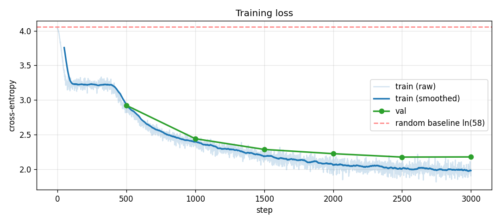
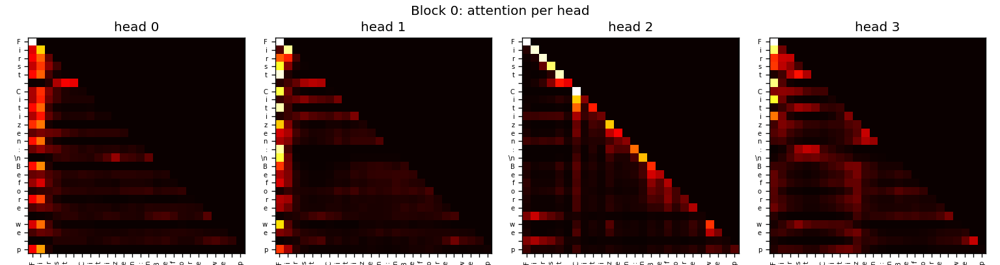

# Transformer from Scratch (NumPy Only)

[](https://github.com/batuhne/transformer-from-scratch/actions/workflows/ci.yml)
[](LICENSE)
[](https://www.python.org/)

A decoder-only (GPT-style) transformer built entirely in **NumPy**, with no deep-learning framework. Every component (multi-head attention, LayerNorm, AdamW, full backpropagation) is hand-derived and checked against numerical gradients. It trains a character-level language model on Shakespeare.

The goal is **implementation correctness**, not text quality: this is a readable, tested, mathematically documented reference for how a transformer actually works under the hood.



## What this is (and is not)

This repo demonstrates that a transformer's forward and backward passes, optimizer, and decoding loop can be written from first principles and verified. On a tiny corpus (~10K characters) a 153K-parameter character model cannot produce real English; it learns character statistics and Shakespearean structure (line breaks, `Name:` speaker tags, vowel/consonant rhythm) and outputs word-shaped text. That is the expected result for a model this size on data this small, and the numbers below show it genuinely learns.

## Results

Validation is a contiguous 10% tail of the corpus, never seen during training.

| Metric | Value |
|--------|-------|
| Parameters | 153,082 |
| Vocabulary | 58 characters |
| Random baseline loss | ln(58) = 4.06 |
| Trained val loss | ~2.16 |
| Trained val perplexity | **~8.7** |
| Training | 3000 steps, ~70s on CPU |

### Ablation: each modern feature vs a stable baseline

Single seed, same data and budget, one feature toggled per row (see [`experiments/ablations.ipynb`](experiments/ablations.ipynb)).

| Config | Val perplexity |
|--------|---------------|
| baseline (grad clip only) | 51.3 |
| + dropout | 11.8 |
| + weight tying | 16.0 |
| + AdamW | 52.6 |
| + LR schedule | 15.7 |
| **full modern stack** | **8.4** |

Dropout is the biggest single win on this corpus; weight decay alone does not help and only pays off stacked with other regularization.

All rows use a single seed, so treat the magnitudes as directional rather than exact. On a corpus this small, seed-to-seed variance is large enough that near-ties (the LR schedule and weight-tying rows, for instance) should not be read as a real ranking; a rigorous comparison would repeat each config across several seeds and report mean and standard deviation.

### KV-cache speedup

Incremental decoding caches each layer's K and V, turning per-step work from O(T^2) into O(T). The advantage grows with context length (see [`experiments/bench_kv_cache.py`](experiments/bench_kv_cache.py)).

| Context length T | Speedup |
|------------------|---------|
| 32 (project default) | 1.4x |
| 128 | 3.2x |
| 256 | 7.5x |

## Learned attention

Every head in block 0, fed a short prompt. The lower-triangular shape confirms the causal mask, and each head learns a distinct mix of local and positional attention.



## What is implemented from scratch

- **Forward and backward** for every layer: embedding, sinusoidal positional encoding, scaled dot-product attention, multi-head attention, LayerNorm, ReLU FFN, linear, softmax, cross-entropy
- **Numerical gradient checks** for each component (central differences, `rel_error < 1e-5`)
- **Modern training stack**: inverted dropout, weight tying, AdamW (decoupled weight decay), global-norm gradient clipping, linear warmup + cosine LR schedule
- **Inference**: KV-cached generation, temperature, top-k, and top-p (nucleus) sampling
- **Evaluation**: deterministic token-weighted perplexity over the full validation set
- **Reproducibility**: a fixed seed reproduces the same loss curve on a given machine and numpy build

## Architecture

```
Token indices
   |
Char embedding (vocab=58, d_model=64) + sinusoidal positional encoding
   |
3x  Pre-LN block:
       LayerNorm -> Multi-Head Attention (4 heads, d_k=16) -> + residual
       LayerNorm -> FFN (d_ff=256, ReLU)                   -> + residual
   |
Final LayerNorm -> Linear (weight-tied with embedding) -> softmax
   |
Next-character distribution
```

Trained with AdamW, dropout 0.1, warmup + cosine schedule, global-norm clipping.

## Project structure

```
transformer-from-scratch/
├── src/transformer/      # the library (forward + backward, all NumPy)
│   ├── linear.py, attention.py, mha.py, layernorm.py, ffn.py
│   ├── block.py, model.py, embedding.py, dropout.py
│   ├── optim.py, schedule.py, train.py
│   ├── generate.py, sampling.py, evaluate.py
│   └── visualize.py, utils.py
├── tests/                # pytest gradient checks and behavior tests
├── notebooks/            # 01-07 tutorial build, demo.ipynb showcase
├── experiments/          # ablations.ipynb, bench_kv_cache.py
├── docs/                 # derivations.md (full math), assets/
└── data/input.txt        # Shakespeare corpus
```

## Quick start

```bash
python3 -m venv venv
source venv/bin/activate
pip install -r requirements.txt
pip install -e .

# Run the end-to-end showcase (train + sample + visualize)
jupyter notebook notebooks/demo.ipynb

# Run the test suite (gradient checks + behavior)
pytest -q
```

Use the shipped checkpoint without re-training:

```python
from transformer import load_pretrained, generate

model, vocab = load_pretrained("checkpoints/shakespeare_char.npz")
print(generate(model, vocab, start="ROMEO:", max_new_tokens=200, temperature=0.8))
```

Or train from scratch via the CLI. On the same machine and numpy build, the default seed reproduces the shipped checkpoint:

```bash
python -m transformer train --seed 42 --out checkpoints/model.npz
```

## Math derivations

[`docs/derivations.md`](docs/derivations.md) works through the gradient of every component by hand: softmax + cross-entropy, LayerNorm backward, attention gradients, the multi-head reshape, Adam with bias correction, the LR schedules, inverted dropout, and weight tying. Each derivation links to the source line that implements it.

## Notebooks

| # | Notebook | Topic |
|---|----------|-------|
| 01 | Foundations | Linear, ReLU, softmax, backprop |
| 02 | Embeddings & Data | Tokenizer, embeddings, positional encoding |
| 03 | Self-Attention | Scaled dot-product attention, causal mask |
| 04 | Multi-Head Attention | Parallel heads + gradient checking |
| 05 | FFN & LayerNorm | Feed-forward network, normalization |
| 06 | Transformer Model | Assembling the full model |
| 07 | Training & Generation | Training loop and sampling |
| -- | demo.ipynb | End-to-end showcase using `src/` |

## License

[MIT](LICENSE)
